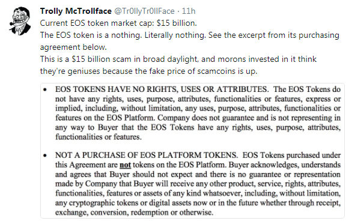

-- [Savedroid Founder & CEO, PhD, Co-Host FinTech Frankfurt/Main (FFM), Former McKinsey & Company Banking Consultant](https://twitter.com/YassinHankir/status/986551967932735488)

_The Secrets of Free Easy Money -
From Zero to Twenty Million in Three Weeks - 500 000+% Return on Investment (ROI) -
Hot Air Token Sales - HODL! HODL! HODL! - To the Moon :chart_with_upwards_trend::chart_with_upwards_trend::chart_with_upwards_trend: -
To the Beach_

# Get Rich Quick "Business Blockchain" Bible

## Step 1: Sell hot air. How?

Package up the hot air in billions of tokens!
Find a symbol and a name - lets say HERO and Herocoin -
and how many decimals and you're in business!

What is a hot air "platform" app token on the blockchain?

The token has:

- No utility.
- No legal rights / claims. Example:

Let's quote the fineprint from the "Legal FAQ" from a "standard" token sale:

> HERO - in whatever form – do NOT represent a claim on or against Byte Heroes, Inc.
> Byte Heroes, Inc. may decide NOT to exchange HEROs - in whatever form - at ANY time at their sole discretion.
> [Thanks for the free money and holding the bag!]
>
> -- Source: Hero Legal FAQ

- No value.

It's all "speculative", that is, hot air. Find greater fools to sell your tokens. How?

## Step 2: Pump up your tokens. How?

Setup and run a "bounty" program. Give away Free tokens!  Free tokens!  Free tokens! Free money! Free money! Free money!
to everyone for spreading the word, that is, pumping your tokens, by sharing, posting, uploading, joining
channels & commenting in Facebook, Twitter, LinkedIn, YouTube, Personal Blog, Reddit, Bitcoin Talk, ...

Example Bounty Program:

> Hero Token is starting their Official Bounty Program in order to reward supporters,
> and it has the biggest Bounty Pools to be awarded ever!
>
> The Program will run until the end of the token sales / initial coin offering (ICO).
>
> A total of 2% Hero Tokens from the Total Supply of Hero Tokens are reserved for the Bounty Campaigns.
> If the hard cap is reached, that amounts to 1.25M Hero Tokens ( 6250 ETH or $1.875M at a price of 300$/ETH ).
>
>
> Total Bounty Pool will be divided As Follows:
>
> - 5% Facebook Campaign
> - 5% Twitter Campaign
> - 5% Reddit Campaign
> - 5% Slack/Telegram Campaign
> - 5% Creative Campaign (Artwork and Videos)
> - 5% Bug Hunt and Creative Development
> - 15% Articles, Reviews, Publications
> - 15% Translation Campaign
> - 30% Exclusive Support
> - 10% Signature Campaign
>
>
> **Facebook Campaign**
>  
> Post about HERO and earn coins. Posts on Facebook must contain ALL of the following hashtags: #HERO #ICO #ethereum
>
> Rules
>
> - Account must be at least 3 months old
> - You must have liked facebook.com/BE-A-HERO
> - Only posts containing all of the above hashtags qualify
> - You can qualify for this bounty with a minimum of 5 posts
> - You can qualify for this bounty with a maximum of 1 post per day
> - To be eligible for reward every participant must post in the Bounty thread links to his posts till every Friday 23:59 UTC
>
> REWARDS:
>
> - \>1.000.000 Followers/friends = 10000 HERO tokens
> - \>500.000 Followers/friends = 5000 HERO tokens
> - \>100.000 Followers/friends = 1500 HERO tokens
> - \>50.000 Followers/friends = 750 HERO tokens
> - \>10.000 Followers/friends = 250 HERO tokens
> - \>1.000 Followers/friends = 50 HERO tokens
> - \>500 Followers = 25 HERO tokens
> - \>100 Followers = 10 HERO tokens
>
> FACEBOOK LIKE
>
> Like us on Facebook
>
> Rules
>
> - Your account must have >100 friends
> - Your account must be at least 3 months old
>
> REWARDS:
>
> - Facebook Account Like = 50 HERO
>
>
> **Twitter Campaign**
>
> Tweets on twitter must contain ALL of the following hashtags: #HERO #ICO #ethereum
>
> Rules
>
> - Account must be at least 3 months old
> - Only Tweets containing all of the above hashtags qualify
> - You must be following twitter.com/BE-A-HERO
> - You can qualify for this bounty with a maximum of 60 (re-)tweets
> - You can qualify for this bounty with a maximum of 10 (re-)tweets per week
> - Retweets must be retweeted from the official @BE-A-HERO channel
> - To be eligible for reward every participant must post in the Bounty thread links to his (re-)tweets till every Friday 23:59 UTC.
>
> REWARDS:
>
> TWEET
>
> - \>1.000.000 Followers: 20000 HERO tokens = €400
> - \>500.000 Followers: 10000 HERO tokens = €200
> - \>100.000 Followers: 4000 HERO tokens = €70
> - \>50.000 Followers: 2000 HERO tokens = €40
> - \>10.000 Followers: 1000 HERO tokens = €20
> - \>1.000 Followers: 400 HERO tokens = €7
> - \>500 Followers: 200 HERO tokens = €4
> - \>100 Followers: 40 HERO tokens = €0.8
>
> RETWEET
>
> - \>1.000.000 Followers: 10000 HERO tokens = €200
> - \>500.000 Followers: 5000 HERO tokens = €100
> - \>100.000 Followers: 2000 HERO tokens = €40
> - \>50.000 Followers: 1000 HERO tokens = €20
> - \>10.000 Followers: 400 HERO tokens = €8
> - \>1.000 Followers: 200 HERO tokens = €4
> - \>500 Followers: 100 HERO tokens = €2
> - \>100 Followers: 20 HERO tokens = €0.4
>
> TWITTER FOLLOW
>
> Follow us on Twitter to earn your coins
>
> Rules
>
> - Your account must have >100 friends
> - Your account must be at least 3 months old
>   
> REWARDS:
>
> - Twitter Follow = 50 HERO tokens
>
>
> and on and on and on

## Step 3: Revolutionize the World.  How?

Get inspired by / copy / clone  hot air (no value) "platform" app token ideas from the real world.
Think big! bigger! biggest! Think next internet! Next printing press! Next alphabet!

### Revolutionize E-Sports / Betting

### Revolutionize Tourism / Ticketing

### Revolutionize Crowdfunding

### Revolutionize Investing / Saving

### Revolutionize Business-to-Business (B2B) Commerce / Trade

### Revolutionize Token Exchanges / Trades

### Revolutionize Philosopher's Stone / Alchemy

## Background - Questions & Answers

### Q: How do Bitcoins differ from "Platform" Hot Air app tokens? 20-Year-Lottery vs Get-Rich-Quick-Cash-Grab-Token-Sales

Crypto Currency (Bitcoin Accepted Here) vs App "Platform" Tokens

Bitcoins get "mined" with every new block every ten minutes. You CANNOT buy newly minted bitcoins.
The bitcoin "lottery" gives away FREE bitcoins
to the lucky winner / number every ten minutes with every block added for the next TWENTY YEARS.

Why a lottery? A random (secure) lottery - using the famous proof-of-work hashing crypto "puzzle" -
is the fairest distribution between all network nodes / peers / players.

vs

App tokens do NOT get mined. You can create / mint as many tokens as you like!
Just punch / type in a number - lets say two billion.
Sell off 30% in an "initial coin offering" (ICO) / token sales to greater fools
in a free money get-rich-quick cash grab running for lets say two or three weeks
and keep the rest "in reserve" for yourself.

It's that easy and with the ready-to-use/ready-to-run Ethereum blockchain / network
you're off in ten minutes!

Free easy money! Buyer beware! Do NOT get scammed by the promise of returns of 50 000% on your "investment"
and the fear of missing out (FOMO) on the next bitcoin.

What Trolly McTrollface says to "ICOs are like Bitcoin / BTC":

### Q: What's an Initial Coin Offering (ICO) / Token Sales?

Read the free excerpt titled [ICOs: Magic Beans and Bubble Machines](https://davidgerard.co.uk/blockchain/icos-magic-beans-and-bubble-machines/) from the book [Attack of the 50 Foot Blockchain](https://davidgerard.co.uk/blockchain/book/) by David Gerard.

> Token offerings have been around a while, but kicked off enormously in the second bubble.
> The usual pretext is crowdfunding, but in practice the tokens are just traded on the exchanges as commodities.
> The creators then cash in. The value proposition for buyers is, as for the creators, easy money in a bubble.
>
> -- David Gerard (Attack of the 50 Foot Blockchain / ICOs: Magic Beans and Bubble Machines)

### Q: What's a Token Sale Scam?

A: If you buy these digital tokens (on the blockchain) giving free money
as a donation / gift to a company to revolutionize
the world one block at a time than everything is ok.

If you buy these digital token (on the blockchain) trying to get rich (quick)
by selling them at a higher price to a greater fool than - surprise, surprise -
you're getting scammed.

Let's quote the fineprint from the "Legal FAQ" from a "standard" token sale:

> HERO - in whatever form – do NOT represent a claim on or against Byte Heroes, Inc.
> Byte Heroes, Inc. may decide NOT to exchange HEROs - in whatever form - at ANY time at their sole discretion.
> [Thanks for the free money and holding the bag!]
>
> -- Source: Hero Legal FAQ

The point is ... you own binary bits (on the blockchain) and
the value is ... excactly zero.  You say? Wait, but the token value is not (yet) excactly zero.
HODL! HODL! How much richer are you today?

Ask yourself why should the company work hard, hard, hard to make you rich, rich, rich
when - surprise, surprise - the company already collected all the free money from greater fools
and  - surprise, surprise - you have zero legal claim to anything.
Welcome to the world of business! Buyer beware!

### Q: How can you say that these "Platform" Token Sales are Scams? Have you read the white paper? Have you seen all these serious honest businessmen, the management team and all advisors and more than dozens of happy faces in the brochure?

A: Money! Money! Money! Breaking news: Free easy money corrupts.

Breaking news: Building a "platform" to revolutionize the online betting market, tourism, token trading, ...  
you need to work, work, work hard
and - surprise, surprise - you need code monkeys (programmers).
Clicky, clicky, clicky and putting on a great dazzling marketing show is NOT good enough.

Ask these companies and happy faces where's the code, code, code?

Remember: Like secure cryptographic algorithms are by definition open - in the 21st century you can by
definition only
build open decentralized platforms with open (source) code.

Ask these companies where are the daily check-ins, check-ins, check-ins?
Where are the daily commits, commits, commits? (†)

Remember: Running (working) code wins.

Without open (source) code for all to see the white paper promises are just dreams or
let's name it straight - big lies and cash grab scams.
Thanks for the free money and hodling the bag!

---

**Disclaimer: Short version: Please think for yourself.**

**Long version: Nothing contained on these pages is, or should be construed as providing or offering, investment, legal, accounting, tax or other advice. Do not act on any opinion expressed here without consulting a qualified professional. Note: The writers do not hold a position in any crypto tokens or cryptocurrency or blockchain company.**

---

**New to CryptoCurrencies and CryptoTokens?**

**See the [Last Week Tonight with John Oliver (HBO) Video on CryptoCurrencies](https://www.youtube.com/watch?v=g6iDZspbRMg) @ YouTube (30min).**

**Digital currencies and "platform" app tokens
are generating a lot of get-rich-quick excitement.
John Oliver enlists Keegan-Michael Key to get potential investors
equally excited about the concept of caution. Buyer beware!**

---

## Fast Exit Case Studies

### Savedroid (SVD) - $50m - Thanks Guys! Over and Out ... Next Stop the Mediterranean Sea / Beach

Savedroid Corp., Frankfurt/Main, Germany

Cryptocurrencies for Everyone - Now! Give Power to the People. Join the Revolution!

Q: Savedroid Initial Coin Offering (ICO): What the tokens will be used for?

> A key question that everyone should ask before buying into an ICO is:
> what will the tokens be used for? In the case of savedroid,
> the token will become the key payment in the new crypto ecosystem of the company - 
> and therefore has good chances to show a strong performance if savedroid’s crypto simplification strategy works:

> The savedroid token (SVD) is a utility token and will be used to purchase the crypto services within the savedroid ecosystem.
> Users of savedroid's automated crypto saving and investing will have to use the savedroid token to pay the fees of these crypto
> services. It has a built-in deflation mechanism to support its future value.
> Users can buy or sell the SVD in supported token exchanges.

<!-- break -->

Self-Learning Secret-Sauce Artificial Intelligence (AI) Black-Box - Magic Savedroid (SVD) Gold Mine Bullshit - Scam Alert! Scam Alert! Scam Alert!

<!-- Turn (Fiat) Cash Into Crypto (Lambos) Bullshit  -- add why? why not??
 -->

<!--
(Source: [`ico.savedroid.com/roadmap` Website](http://ico.savedroid.com/roadmap))
-->

2022  -- Self-learning AI algorithm enabling world peace / paradise providing
free easy money for everyone

2024  -- Self-learning AI algorithm enabling singularity. Machines scam the mere mortal human dummies
and run off with the free easy money. Your savings are gone

> Within savedroid's unique [self-learning secret-sauce black-box] artificial intelligence (AI) fueled ecosystem, 
> users will profit from convenient crypto saving plans and superior crypto investment opportunities, 
> such as portfolios, derivatives, and ICOs. 
> savedroid will conveniently auto-convert savings to cryptocurrencies, 
> securely store them, and make them easily accessible, tradeable, and spendable.
> We will offer all of these crypto services for a reasonable fee in savedroid (SVD) tokens.
>
> **When a user takes his savedroid tokens to pay for a crypto service, we collect his savedroid tokens and automatically burn a
> percentage of these tokens. Thus, the number of available savedroid tokens will decrease over time. 
> The bottom line is that this will support the future value of the savedroid token.**
>
> In other words, a percentage of the savedroid crypto service fees will automatically be removed from the pool of available SVDs 
> by every single purchase. Thus, the more the savedroid ecosystem is used, the further the supply of SVD will decrease.
>
> So, eventually, our user growth will drive an increasing demand for savedroid tokens on the one hand and, at the same time,
> a decreasing supply of savedroid tokens on the other hand. 
> Hence, the value of the savedroid token depends, among other factors, on our future user growth of greater fools
> [Thanks for the free money and HODLing the bag!].

(Source: [Official Savedroid ICO News - What the tokens will be used for](https://medium.com/@ico_8796/savedroid-ico-what-the-tokens-will-be-used-for-d88011554638), February 6th, 2018)

(Source: [`ico.savedroid.com` Website](http://ico.savedroid.com), April 17th, 2018)

> We are part of Deutsche Börse's FinTech Hub and Venture Network and collaborate 
> with various prestigious Business-to-Business (B2B) partners.
> In fact, savedroid is the first initial coin offering (ICO) of a German stock corporation 
> that follows German legislation and regulation to provide participants with the highest level of security.

-- [Savedroid Founder & CEO, PhD, Co-Host FinTech Frankfurt/Main (FFM), Former McKinsey & Company Banking Consultant](https://twitter.com/YassinHankir/status/986551967932735488)

(Source: [`ico.savedroid.com` Website](http://ico.savedroid.com), April 18th, 2018)

> The founders of cryptocurrency startup Savedroid appear to have exit-scammed investors following
> the conclusion of its initial coin offering (ICO).
>
> On Wednesday, the website for the German company unexpectedly went offline and has since been replaced by a single image -
> the "Aannd It's Gone" meme, which first originated on South Park.
>
> And in case investors still did not get the message, Yassin Hankir, the project's founder and CEO,
> published a Twitter post that showed him in an airport and later on a beach, holding a beer.
>
> "Thanks guys! Over and out.. #savedroidICO" he wrote.  
>
> -- [ICO News, Over and Out: $50 Million Savedroid ICO Makes Apparent Exit Scam](https://www.ccn.com/over-and-out-savedroid-ico-makes-apparent-exit-scam/), April 18th, 2018

> The CEO on their twitter feed posted this several times
> 'contribute now to participate in our #Airdrop and become a #Crypto Millionaire.'
> Not about technology, its all about GIVE US MONEY AND WE WILL MAKE YOU A MILLIONAIRE.
> Anyone who fell for this despite all the warning signs can blame no one but
> themselves.
>
> -- [TechCrunch News, Another day, another $50 million ICO exit scam](https://techcrunch.com/2018/04/18/another-day-another-50-million-ico-exit-scam/), April 18th, 2018
