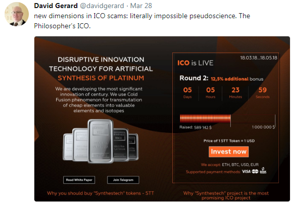

_The Secrets of Free Easy Money -
From Zero to Twenty Million in Three Weeks - 500 000+% Return on Investment (ROI) -
Hot Air Token Sales - HODL! HODL! HODL! - To the Moon :chart_with_upwards_trend::chart_with_upwards_trend::chart_with_upwards_trend: -
To the Beach_

-- [Savedroid Founder & CEO, PhD, Co-Host FinTech Frankfurt/Main (FFM), Former McKinsey & Company Banking Consultant](https://twitter.com/YassinHankir/status/986551967932735488)

## Step 1: Sell hot air. How?

Package up the hot air in billions of tokens!
Find a symbol and a name - lets say HERO and Herocoin -
and how many decimals and you're in business!

What is a hot air "platform" app token on the blockchain?

The token has:

- No utility.
- No legal rights / claims. Example:

Let's quote the fineprint from the "Legal FAQ" from a "standard" token sale:

> HERO - in whatever form – do NOT represent a claim on or against Byte Heroes, Inc.
> Byte Heroes, Inc. may decide NOT to exchange HEROs - in whatever form - at ANY time at their sole discretion.
> [Thanks for the free money and holding the bag!]
>
> -- Source: Hero Legal FAQ

- No value.

It's all "speculative", that is, hot air. Find greater fools to sell your tokens. How?

## Step 2: Pump up your tokens. How?

Setup and run a "bounty" program. Give away Free tokens!  Free tokens!  Free tokens! Free money! Free money! Free money!
to everyone for spreading the word, that is, pumping your tokens, by sharing, posting, uploading, joining
channels & commenting in Facebook, Twitter, LinkedIn, YouTube, Personal Blog, Reddit, Bitcoin Talk, ...

Example Bounty Program:

> Hero Token is starting their Official Bounty Program in order to reward supporters,
> and it has the biggest Bounty Pools to be awarded ever!
>
> The Program will run until the end of the token sales / initial coin offering (ICO).
>
> A total of 2% Hero Tokens from the Total Supply of Hero Tokens are reserved for the Bounty Campaigns.
> If the hard cap is reached, that amounts to 1.25M Hero Tokens ( 6250 ETH or $1.875M at a price of 300$/ETH ).
>
>
> Total Bounty Pool will be divided As Follows:
>
> - 5% Facebook Campaign
> - 5% Twitter Campaign
> - 5% Reddit Campaign
> - 5% Slack/Telegram Campaign
> - 5% Creative Campaign (Artwork and Videos)
> - 5% Bug Hunt and Creative Development
> - 15% Articles, Reviews, Publications
> - 15% Translation Campaign
> - 30% Exclusive Support
> - 10% Signature Campaign
>
>
> **Facebook Campaign**
>  
> Post about HERO and earn coins. Posts on Facebook must contain ALL of the following hashtags: #HERO #ICO #ethereum
>
> Rules
>
> - Account must be at least 3 months old
> - You must have liked facebook.com/BE-A-HERO
> - Only posts containing all of the above hashtags qualify
> - You can qualify for this bounty with a minimum of 5 posts
> - You can qualify for this bounty with a maximum of 1 post per day
> - To be eligible for reward every participant must post in the Bounty thread links to his posts till every Friday 23:59 UTC
>
> REWARDS:
>
> - \>1.000.000 Followers/friends = 10000 HERO tokens
> - \>500.000 Followers/friends = 5000 HERO tokens
> - \>100.000 Followers/friends = 1500 HERO tokens
> - \>50.000 Followers/friends = 750 HERO tokens
> - \>10.000 Followers/friends = 250 HERO tokens
> - \>1.000 Followers/friends = 50 HERO tokens
> - \>500 Followers = 25 HERO tokens
> - \>100 Followers = 10 HERO tokens
>
> FACEBOOK LIKE
>
> Like us on Facebook
>
> Rules
>
> - Your account must have >100 friends
> - Your account must be at least 3 months old
>
> REWARDS:
>
> - Facebook Account Like = 50 HERO
>
>
> **Twitter Campaign**
>
> Tweets on twitter must contain ALL of the following hashtags: #HERO #ICO #ethereum
>
> Rules
>
> - Account must be at least 3 months old
> - Only Tweets containing all of the above hashtags qualify
> - You must be following twitter.com/BE-A-HERO
> - You can qualify for this bounty with a maximum of 60 (re-)tweets
> - You can qualify for this bounty with a maximum of 10 (re-)tweets per week
> - Retweets must be retweeted from the official @BE-A-HERO channel
> - To be eligible for reward every participant must post in the Bounty thread links to his (re-)tweets till every Friday 23:59 UTC.
>
> REWARDS:
>
> TWEET
>
> - \>1.000.000 Followers: 20000 HERO tokens = €400
> - \>500.000 Followers: 10000 HERO tokens = €200
> - \>100.000 Followers: 4000 HERO tokens = €70
> - \>50.000 Followers: 2000 HERO tokens = €40
> - \>10.000 Followers: 1000 HERO tokens = €20
> - \>1.000 Followers: 400 HERO tokens = €7
> - \>500 Followers: 200 HERO tokens = €4
> - \>100 Followers: 40 HERO tokens = €0.8
>
> RETWEET
>
> - \>1.000.000 Followers: 10000 HERO tokens = €200
> - \>500.000 Followers: 5000 HERO tokens = €100
> - \>100.000 Followers: 2000 HERO tokens = €40
> - \>50.000 Followers: 1000 HERO tokens = €20
> - \>10.000 Followers: 400 HERO tokens = €8
> - \>1.000 Followers: 200 HERO tokens = €4
> - \>500 Followers: 100 HERO tokens = €2
> - \>100 Followers: 20 HERO tokens = €0.4
>
> TWITTER FOLLOW
>
> Follow us on Twitter to earn your coins
>
> Rules
>
> - Your account must have >100 friends
> - Your account must be at least 3 months old
>   
> REWARDS:
>
> - Twitter Follow = 50 HERO tokens
>
>
> and on and on and on

## Step 3: Revolutionize the World.  How?

Get inspired by / copy / clone  hot air (no value) "platform" app token ideas from the real world.
Think big! bigger! biggest! Think next internet! Next printing press! Next alphabet!

### Revolutionize E-Sports / Betting

### Revolutionize Tourism / Ticketing

### Revolutionize Crowdfunding

### Revolutionize Investing / Saving

### Revolutionize Business-to-Business (B2B) Commerce / Trade

### Revolutionize Token Exchanges / Trades

### Revolutionize Philosopher's Stone / Alchemy

