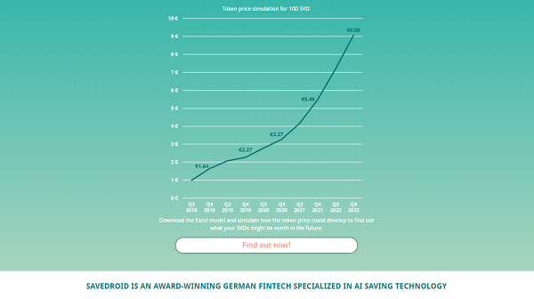

## Savedroid (SVD) - $50m - Thanks Guys! Over and Out ... Next Stop the Mediterranean Sea / Beach

Savedroid Corp., Frankfurt/Main, Germany

Cryptocurrencies for Everyone - Now! Give Power to the People. Join the Revolution!

Q: Savedroid Initial Coin Offering (ICO): What the tokens will be used for?

> A key question that everyone should ask before buying into an ICO is:
> what will the tokens be used for? In the case of savedroid,
> the token will become the key payment in the new crypto ecosystem of the company - 
> and therefore has good chances to show a strong performance if savedroid’s crypto simplification strategy works:

> The savedroid token (SVD) is a utility token and will be used to purchase the crypto services within the savedroid ecosystem.
> Users of savedroid's automated crypto saving and investing will have to use the savedroid token to pay the fees of these crypto
> services. It has a built-in deflation mechanism to support its future value.
> Users can buy or sell the SVD in supported token exchanges.

<!-- break -->

Self-Learning Secret-Sauce Artificial Intelligence (AI) Black-Box - Magic Savedroid (SVD) Gold Mine Bullshit - Scam Alert! Scam Alert! Scam Alert!

<!-- Turn (Fiat) Cash Into Crypto (Lambos) Bullshit  -- add why? why not??
 -->

<!--
(Source: [`ico.savedroid.com/roadmap` Website](http://ico.savedroid.com/roadmap))
-->

2022  -- Self-learning AI algorithm enabling world peace / paradise providing
free easy money for everyone

2024  -- Self-learning AI algorithm enabling singularity. Machines scam the mere mortal human dummies
and run off with the free easy money. Your savings are gone

> Within savedroid's unique [self-learning secret-sauce black-box] artificial intelligence (AI) fueled ecosystem,
> users will profit from convenient crypto saving plans and superior crypto investment opportunities,
> such as portfolios, derivatives, and ICOs.
> savedroid will conveniently auto-convert savings to cryptocurrencies,
> securely store them, and make them easily accessible, tradeable, and spendable.
> We will offer all of these crypto services for a reasonable fee in savedroid (SVD) tokens.
>
> **When a user takes his savedroid tokens to pay for a crypto service, we collect his savedroid tokens and automatically burn a
> percentage of these tokens. Thus, the number of available savedroid tokens will decrease over time.
> The bottom line is that this will support the future value of the savedroid token.**
>
> In other words, a percentage of the savedroid crypto service fees will automatically be removed from the pool of available SVDs
> by every single purchase. Thus, the more the savedroid ecosystem is used, the further the supply of SVD will decrease.
>
> So, eventually, our user growth will drive an increasing demand for savedroid tokens on the one hand and, at the same time,
> a decreasing supply of savedroid tokens on the other hand.
> Hence, the value of the savedroid token depends, among other factors, on our future user growth of greater fools
> [Thanks for the free money and HODLing the bag!].

(Source: [Official Savedroid ICO News - What the tokens will be used for](https://medium.com/@ico_8796/savedroid-ico-what-the-tokens-will-be-used-for-d88011554638), February 6th, 2018)

(Source: [`ico.savedroid.com` Website](http://ico.savedroid.com), April 17th, 2018)

> We are part of Deutsche Börse's FinTech Hub and Venture Network and collaborate
> with various prestigious Business-to-Business (B2B) partners.
> In fact, savedroid is the first initial coin offering (ICO) of a German stock corporation
> that follows German legislation and regulation to provide participants with the highest level of security.

-- [Savedroid Founder & CEO, PhD, Co-Host FinTech Frankfurt/Main (FFM), Former McKinsey & Company Banking Consultant](https://twitter.com/YassinHankir/status/986551967932735488)

(Source: [`ico.savedroid.com` Website](http://ico.savedroid.com), April 18th, 2018)

> The founders of cryptocurrency startup Savedroid appear to have exit-scammed investors following
> the conclusion of its initial coin offering (ICO).
>
> On Wednesday, the website for the German company unexpectedly went offline and has since been replaced by a single image -
> the "Aannd It's Gone" meme, which first originated on South Park.
>
> And in case investors still did not get the message, Yassin Hankir, the project's founder and CEO,
> published a Twitter post that showed him in an airport and later on a beach, holding a beer.
>
> "Thanks guys! Over and out.. #savedroidICO" he wrote.  
>
> -- [ICO News, Over and Out: $50 Million Savedroid ICO Makes Apparent Exit Scam](https://www.ccn.com/over-and-out-savedroid-ico-makes-apparent-exit-scam/), April 18th, 2018

> The CEO on their twitter feed posted this several times
> 'contribute now to participate in our #Airdrop and become a #Crypto Millionaire.'
> Not about technology, its all about GIVE US MONEY AND WE WILL MAKE YOU A MILLIONAIRE.
> Anyone who fell for this despite all the warning signs can blame no one but
> themselves.
>
> -- [TechCrunch News, Another day, another $50 million ICO exit scam](https://techcrunch.com/2018/04/18/another-day-another-50-million-ico-exit-scam/), April 18th, 2018
