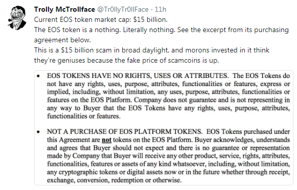
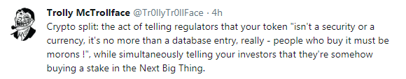
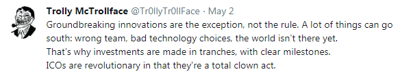

## Q: How do Bitcoins differ from "Platform" Hot Air app tokens? 20-Year-Lottery vs Get-Rich-Quick-Cash-Grab-Token-Sales

Crypto Currency (Bitcoin Accepted Here) vs App "Platform" Tokens

Bitcoins get "mined" with every new block every ten minutes. You CANNOT buy newly minted bitcoins.
The bitcoin "lottery" gives away FREE bitcoins
to the lucky winner / number every ten minutes with every block added for the next TWENTY YEARS.

Why a lottery? A random (secure) lottery - using the famous proof-of-work hashing crypto "puzzle" -
is the fairest distribution between all network nodes / peers / players.

vs

App tokens do NOT get mined. You can create / mint as many tokens as you like!
Just punch / type in a number - lets say two billion.
Sell off 30% in an "initial coin offering" (ICO) / token sales to greater fools
in a free money get-rich-quick cash grab running for lets say two or three weeks
and keep the rest "in reserve" for yourself.

It's that easy and with the ready-to-use/ready-to-run Ethereum blockchain / network
you're off in ten minutes!

Free easy money! Buyer beware! Do NOT get scammed by the promise of returns of 50 000% on your "investment"
and the fear of missing out (FOMO) on the next bitcoin.

What Trolly McTrollface says to "ICOs are like Bitcoin / BTC":

## Q: What's an Initial Coin Offering (ICO) / Token Sales?

Read the free excerpt titled [ICOs: Magic Beans and Bubble Machines](https://davidgerard.co.uk/blockchain/icos-magic-beans-and-bubble-machines/) from the book [Attack of the 50 Foot Blockchain](https://davidgerard.co.uk/blockchain/book/) by David Gerard.

> Token offerings have been around a while, but kicked off enormously in the second bubble.
> The usual pretext is crowdfunding, but in practice the tokens are just traded on the exchanges as commodities.
> The creators then cash in. The value proposition for buyers is, as for the creators, easy money in a bubble.
>
> -- David Gerard (Attack of the 50 Foot Blockchain / ICOs: Magic Beans and Bubble Machines)

## Q: What's a Token Sale Scam?

A: If you buy these digital tokens (on the blockchain) giving free money
as a donation / gift to a company to revolutionize
the world one block at a time than everything is ok.

If you buy these digital token (on the blockchain) trying to get rich (quick)
by selling them at a higher price to a greater fool than - surprise, surprise -
you're getting scammed.

Let's quote the fineprint from the "Legal FAQ" from a "standard" token sale:

> HERO - in whatever form – do NOT represent a claim on or against Byte Heroes, Inc.
> Byte Heroes, Inc. may decide NOT to exchange HEROs - in whatever form - at ANY time at their sole discretion.
> [Thanks for the free money and holding the bag!]
>
> -- Source: Hero Legal FAQ

The point is ... you own binary bits (on the blockchain) and
the value is ... excactly zero.  You say? Wait, but the token value is not (yet) excactly zero.
HODL! HODL! How much richer are you today?

Ask yourself why should the company work hard, hard, hard to make you rich, rich, rich
when - surprise, surprise - the company already collected all the free money from greater fools
and  - surprise, surprise - you have zero legal claim to anything.
Welcome to the world of business! Buyer beware!

## Q: How can you say that these "Platform" Token Sales are Scams? Have you read the white paper? Have you seen all these serious honest businessmen, the management team and all advisors and more than dozens of happy faces in the brochure?

A: Money! Money! Money! Breaking news: Free easy money corrupts.

Breaking news: Building a "platform" to revolutionize the online betting market, tourism, token trading, ...  
you need to work, work, work hard
and - surprise, surprise - you need code monkeys (programmers).
Clicky, clicky, clicky and putting on a great dazzling marketing show is NOT good enough.

Ask these companies and happy faces where's the code, code, code?

Remember: Like secure cryptographic algorithms are by definition open - in the 21st century you can by
definition only
build open decentralized platforms with open (source) code.

Ask these companies where are the daily check-ins, check-ins, check-ins?
Where are the daily commits, commits, commits? (†)

Remember: Running (working) code wins.

Without open (source) code for all to see the white paper promises are just dreams or
let's name it straight - big lies and cash grab scams.
Thanks for the free money and hodling the bag!

